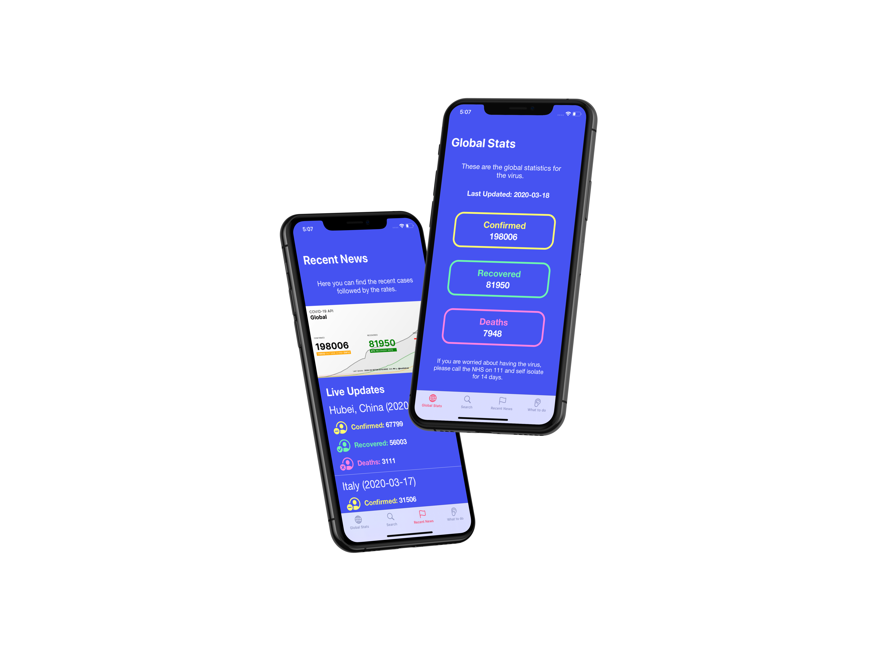

# CoronavirusCases

## What is it?

CoronavirusCases is a simple iOS app which allows you to check global statistics, statistics for your country and also keep up to date with live updates. The app uses an API build my mathdro.id which allows me to query new data for each day. I obtain the day using NSDate in the app. 

## Technologies Used

- Programmatic UI / Child VC's / Attributed Strings / Custom UIColours
- Mathdro.id API (https://covid19.mathdro.id/api)

## How do we use it?

- Download the app by cloning the repository
- Run the app on your device locally
- You are good to go!

## Thank you!

Hope you love the project, i certainly enjoyed making it.
